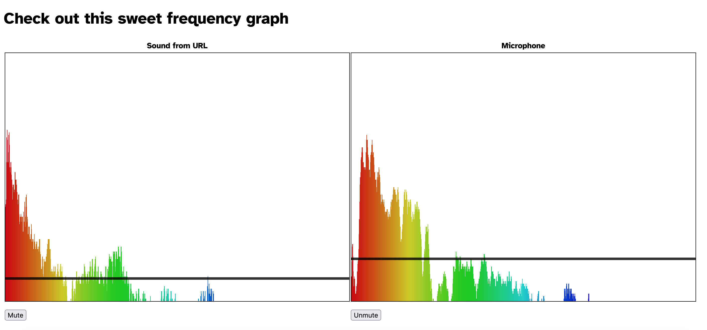

# Sound, but pretty

Displays audio frequency graphs



## Install

```
git clone https://github.com/LeopoldTal/sound-but-pretty.git
cd sound-but-pretty/
yarn
```

## Usage

```
yarn start
```

Your browser will open to the app page. Enable Javascript and allow microphone access to see the display.
